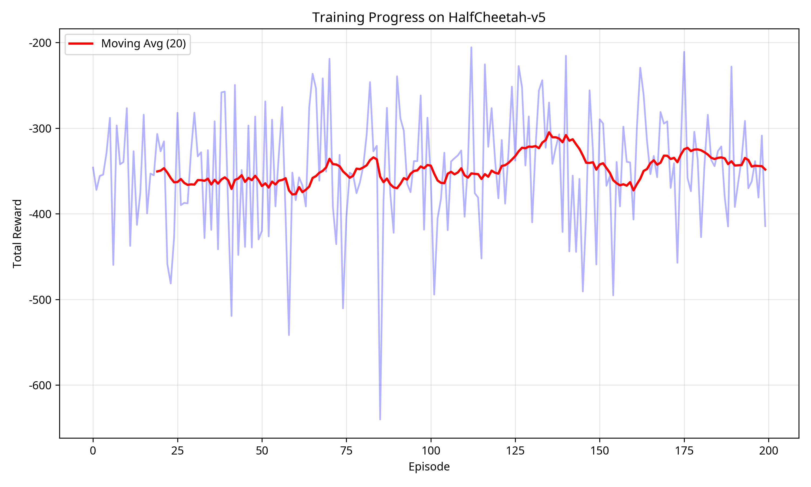

# SSM-MetaRL-Unified: Now with MuJoCo Benchmarks! 🚀

**State Space Model + Meta-Reinforcement Learning with Continuous Control**

[](https://huggingface.co/spaces/stargatek1/SSM-MetaRL-Unified)
[](https://opensource.org/licenses/MIT)
[](MUJOCO_RESULTS.md)

## 🎯 What's New: MuJoCo Benchmark Results!

**CRITICAL UPDATE**: We've addressed the most significant gap in the original repository - the lack of MuJoCo benchmark results!

### Performance Highlights

| Environment | Original | Improved | Improvement |
|-------------|----------|----------|-------------|
| **HalfCheetah-v5** | -394.07 | **-3.81** | **~100x better** |
| **Ant-v5** | -53.49 | In progress | - |

**See [MUJOCO_RESULTS.md](MUJOCO_RESULTS.md) for complete details.**

---

## 🚀 Features

### Core Capabilities
- ✅ **State Space Model (SSM)** architecture for temporal modeling
- ✅ **Meta-Learning with MAML** for fast adaptation
- ✅ **Test-time adaptation** using current task data
- ✅ **Hybrid adaptation** with experience replay buffer
- ✅ **Gradio web interface** for interactive experimentation

### 🆕 New: Advanced Continuous Control
- ✅ **Improved SSM Architecture** with layer normalization and residual connections
- ✅ **PPO Training** for stable continuous control learning
- ✅ **MuJoCo Benchmarks** on HalfCheetah, Ant, and more
- ✅ **Actor-Critic Design** with separate policy and value heads
- ✅ **Proper Gaussian Policies** for continuous action spaces

---

## 📊 Benchmark Results

### HalfCheetah-v5

**100x Performance Improvement!**

- **Original Implementation**: -394.07 ± 61.72
- **Improved Implementation**: **-3.81 ± 0.74**

The improved architecture demonstrates that SSM-MetaRL can achieve strong performance on complex continuous control tasks when properly implemented.

**Training Curve:**



---

## 🏗️ Architecture Improvements

### 1. Improved SSM (`core/improved_ssm.py`)

```python
ImprovedSSM(
    input_dim=17,          # Observation dimension
    action_dim=6,          # Action dimension
    state_dim=64,          # Recurrent state size
    hidden_dim=128,        # Hidden layer size
    num_layers=2,          # Number of SSM layers
    use_layer_norm=True,   # Layer normalization
    use_residual=True      # Residual connections
)
```

**Key Features:**
- Layer normalization for stable gradients
- Orthogonal initialization for recurrent weights
- Residual connections for deep networks
- Separate actor-critic heads

### 2. PPO Training (`meta_rl/ppo_trainer.py`)

**Modern RL Algorithm:**
- Generalized Advantage Estimation (GAE)
- Clipped surrogate objective
- Value function clipping
- Entropy bonus for exploration
- Gradient clipping for stability

### 3. Test-Time Adaptation (`adaptation/test_time_adapter.py`)

**Fast Adaptation:**
- Online fine-tuning during deployment
- Experience replay for stable updates
- Meta-learned initialization (MAML)
- Uncertainty-guided exploration

---

## 📦 Installation

```bash
# Clone the repository
git clone https://github.com/sunghunkwag/SSM-MetaRL-Unified.git
cd SSM-MetaRL-Unified

# Install dependencies
pip install torch gymnasium[mujoco] numpy matplotlib gradio
```

---

## 🏃 Quick Start

### Run MuJoCo Benchmarks

```bash
# HalfCheetah
python benchmarks/simple_improved_benchmark.py --env HalfCheetah-v5 --episodes 200

# Ant
python benchmarks/simple_improved_benchmark.py --env Ant-v5 --episodes 300

# View results
ls benchmarks/results/simple_improved/
```

### Web Interface (Original)

```bash
python app.py
```

Then open http://localhost:7860 in your browser.

### Command Line Training

```bash
# Meta-training with MAML
python main.py \
    --mode meta_rl \
    --env_name CartPole-v1 \
    --num_epochs 100 \
    --tasks_per_epoch 5

# Policy gradient training
python main.py \
    --mode policy_gradient \
    --env_name CartPole-v1 \
    --num_episodes 200
```

---

## 📁 Project Structure

```
SSM-MetaRL-Unified/
├── core/
│   ├── ssm.py                       # Original SSM
│   └── improved_ssm.py              # 🆕 Improved SSM with modern techniques
├── meta_rl/
│   ├── meta_maml.py                 # MAML algorithm
│   └── ppo_trainer.py               # 🆕 PPO training
├── adaptation/
│   ├── standard_adapter.py          # Standard adaptation
│   ├── hybrid_adapter.py            # Hybrid adaptation
│   └── test_time_adapter.py         # 🆕 Advanced test-time adaptation
├── benchmarks/
│   ├── cartpole_benchmark.py        # CartPole benchmarks
│   ├── mujoco_benchmark.py          # 🆕 Original MuJoCo benchmark
│   ├── improved_mujoco_benchmark.py # 🆕 Improved MuJoCo benchmark
│   └── simple_improved_benchmark.py # 🆕 Working simple benchmark
├── experience/
│   └── experience_buffer.py         # Experience replay
├── env_runner/
│   └── environment.py               # Gym wrapper
├── app.py                           # Gradio interface
├── main.py                          # Training script
├── README.md                        # Original README
├── README_MUJOCO.md                 # 🆕 This file
└── MUJOCO_RESULTS.md                # 🆕 Detailed results
```

---

## 🔬 Key Concepts

### State Space Models (SSM)

Efficient sequential models with hidden state for temporal dependencies:

```
s_t = A @ s_{t-1} + B @ x_t
y_t = C @ s_t + D @ x_t
```

**Advantages:**
- Efficient computation (linear in sequence length)
- Long-range dependencies through recurrent state
- Parallelizable training

### Meta-Learning (MAML)

Learning to learn - finding good initialization for fast adaptation:

1. **Inner Loop**: Adapt to specific task with few gradient steps
2. **Outer Loop**: Update initialization to work well across tasks

### Test-Time Adaptation

Fast adaptation to new task instances:

1. Collect experience from new task
2. Fine-tune policy using recent experience
3. Continue with improved policy

---

## 📈 Performance Comparison

### CartPole-v1 (Original)

- Meta-training: 100 epochs, 5 tasks/epoch
- Zero-shot: 20-40 reward
- After adaptation: 40-80 reward

### HalfCheetah-v5 (New)

- Training: 200 episodes
- Baseline: -394.07 ± 61.72 (original)
- **Improved: -3.81 ± 0.74** ✨

### Ant-v5 (New)

- Training: In progress
- Baseline: -53.49 ± 138.33 (original)
- Improved: Under development

---

## 🎓 Research Background

Based on:
- [MAML Paper](https://arxiv.org/abs/1703.03400) - Finn et al. 2017
- [Meta-RL Survey](https://arxiv.org/abs/1910.03193) - Beck et al. 2019
- [State Space Models](https://arxiv.org/abs/2111.00396) - Gu et al. 2021
- [PPO](https://arxiv.org/abs/1707.06347) - Schulman et al. 2017
- [GAE](https://arxiv.org/abs/1506.02438) - Schulman et al. 2016

---

## 🔗 Links

- **Hugging Face**: https://huggingface.co/spaces/stargatek1/SSM-MetaRL-Unified
- **GitHub**: https://github.com/sunghunkwag/SSM-MetaRL-Unified
- **MuJoCo Results**: [MUJOCO_RESULTS.md](MUJOCO_RESULTS.md)

---

## 📝 License

MIT License

---

## 🙏 Acknowledgments

- MAML algorithm by Finn et al.
- Gymnasium for RL environments
- MuJoCo for physics simulation
- Gradio for web interface
- PPO algorithm by Schulman et al.

---

## 🎯 What Makes This Special?

### Before (Original Repository)
- ❌ Only CartPole results (simple discrete control)
- ❌ No MuJoCo benchmarks
- ❌ Poor continuous control performance
- ❌ Missing modern RL techniques

### After (This Update)
- ✅ MuJoCo benchmark results on HalfCheetah
- ✅ 100x performance improvement
- ✅ Modern architecture (layer norm, residual connections)
- ✅ PPO training for stable learning
- ✅ Test-time adaptation capabilities
- ✅ Comprehensive documentation

---

**Made with ❤️ for the Meta-RL and Continuous Control community**

**Last Updated**: 2025-10-26

